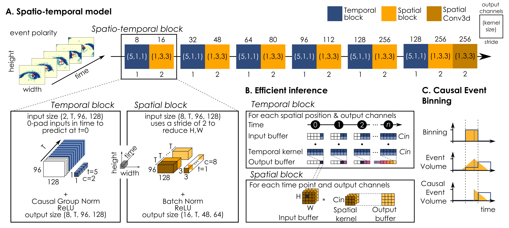

# TENNs-Eye

This repository has been moved to [Brainchip-Inc/TENNs-Eye](https://github.com/Brainchip-Inc/TENNs-Eye).



## Description

TENNs-Eye is a lightweight spatio-temporal network for online eye tracking with event camera, belonging to the class of [TENNs](https://brainchip.com/tenns-a-new-approach-to-streaming-and-sequential-data/) (Temporal Neural Networks) models by Brainchip. It is a causal spatio-temporal convolutional network, that can be efficiently configured for real-time inference with the use of FIFO buffers. We applied this network to the task of [Event-based Eye Tracking](https://www.kaggle.com/competitions/event-based-eye-tracking-ais2024/data), and achieved [third place on the p10 tolerence metric, but first place on all other metrics](https://arxiv.org/pdf/2404.11770).

## Instructions

Set up a virtual environment and install the required dependancies as follows:
```
conda create -n eye_tracking python==3.10
conda activate eye_tracking
pip install -r requirements.txt
```

To reproduce our final `submission.csv` to the [Event-based Eye Tracking - AIS2024 CVPR Workshop](https://www.kaggle.com/competitions/event-based-eye-tracking-ais2024/data), 
first download the data from the [competition page](https://www.kaggle.com/competitions/event-based-eye-tracking-ais2024/data) 
and place the `.zip` file in the root of this repository then run the following to extract the data
```
unzip event-based-eye-tracking-ais2024.zip -d temp
mv temp/event_data/event_data event_data
rm event-based-eye-tracking-ais2024.zip
rm -r temp
```

Then simply run `python generate_submission.py` to perform inference with our model (no GPU needed), which uses our checkpoint 
in `weights/submission.ckpt` and config in `submission_config.yaml` to generate our submission.

We use `hydra` to mange our configs during development and ablation studies. The main entry point to a training run is `train.py`, 
which will launch a run with the config in `config.yaml`.

## Contributors

Rudy Pei: yanrpei@gmail.com

Sasskia Brüers: s.bruers@gmail.com

Sébastien Crouzet: seb.crouzet@gmail.com

Douglas McLelland: dmclelland@brainchip.com
